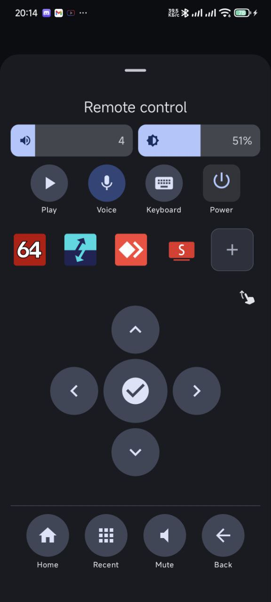
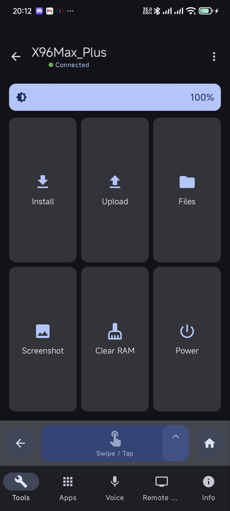
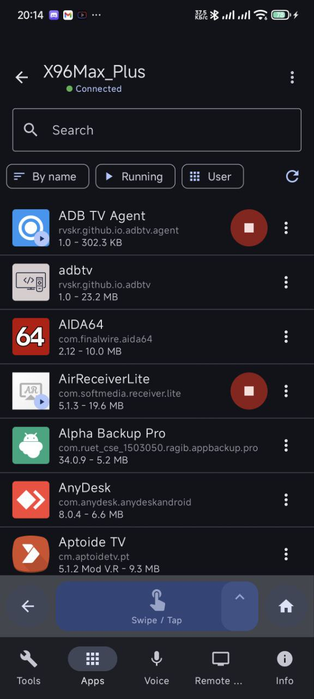
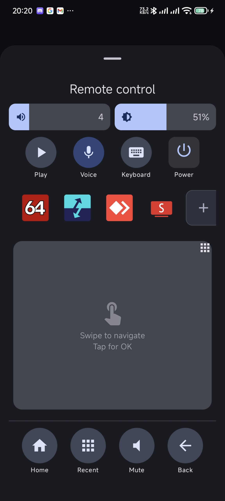
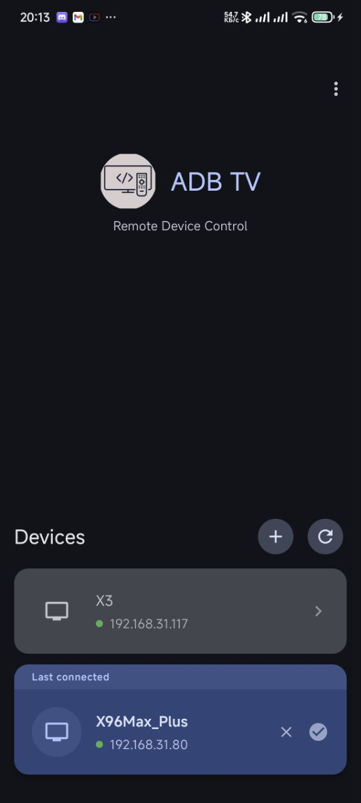
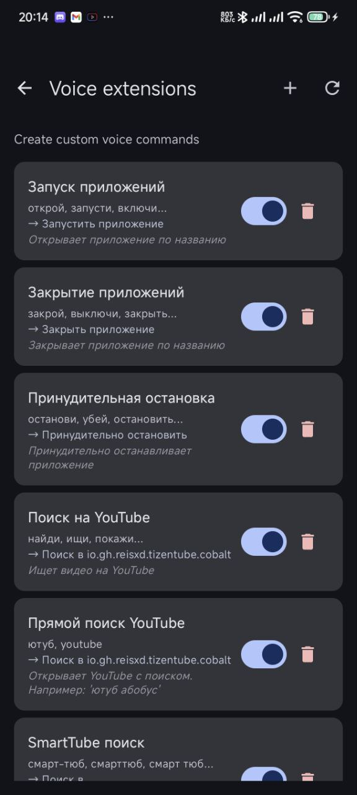

# ADB TV: Мощный инструмент для управления Android TV через ADB

ADB TV — это комплексное решение для удаленного управления вашими устройствами Android TV, Smart TV и приставками через ADB по Wi-Fi.

  
  
  
   
  
  
  

---

## 🎯 ОСНОВНЫЕ ВОЗМОЖНОСТИ:

* Удаленное управление Android TV через WiFi
* Установка и удаление приложений
* Файловый менеджер с загрузкой/скачиванием файлов
* Голосовой поиск и команды
* Выполнение shell команд
* Информация о системе устройства
* Скриншоты экрана
* Управление питанием (перезагрузка, выключение)

## 📱 УПРАВЛЕНИЕ ПРИЛОЖЕНИЯМИ

Легко управляйте всеми установленными приложениями: устанавливайте новые, удаляйте, очищайте данные и многое другое.

* Просмотр установленных приложений
* Установка APK файлов
* Удаление приложений
* Принудительная остановка
* Очистка данных
* Управление разрешениями
* Загрузка APK с устройства

## 📁 ФАЙЛОВЫЙ МЕНЕДЖЕР

Полный доступ к файловой системе вашего TV для простой передачи и управления файлами.

* Просмотр файловой системы
* Загрузка файлов на TV
* Скачивание файлов с TV
* Удаление и переименование
* Установка APK файлов

## 🎤 ГОЛОСОВОЕ УПРАВЛЕНИЕ

Используйте голосовые возможности для поиска и быстрого запуска приложений.

* Голосовой поиск на TV
* Запуск приложений голосом
* Настраиваемые голосовые команды
* Поддержка русского и английского языков

## 🛠️ ИНСТРУМЕНТЫ

Мощные инструменты для системного администрирования, диагностики и управления питанием.

* Выполнение shell команд
* Информация о процессоре, памяти, батарее
* Очистка RAM
* Создание скриншотов
* Управление питанием

---

## ⚙️ ТРЕБОВАНИЯ

* Android TV с включенной отладкой по USB/Network ADB
* Устройства должны быть в одной сети WiFi

## 🔒 КОНФИДЕНЦИАЛЬНОСТЬ

Мы ценим вашу конфиденциальность:
* Все данные хранятся локально
* Нет передачи данных на серверы
* Открытый исходный код

---

## 📝 ПРИМЕЧАНИЕ
Для работы требуется включить отладку по ADB на вашем Android TV устройстве.
