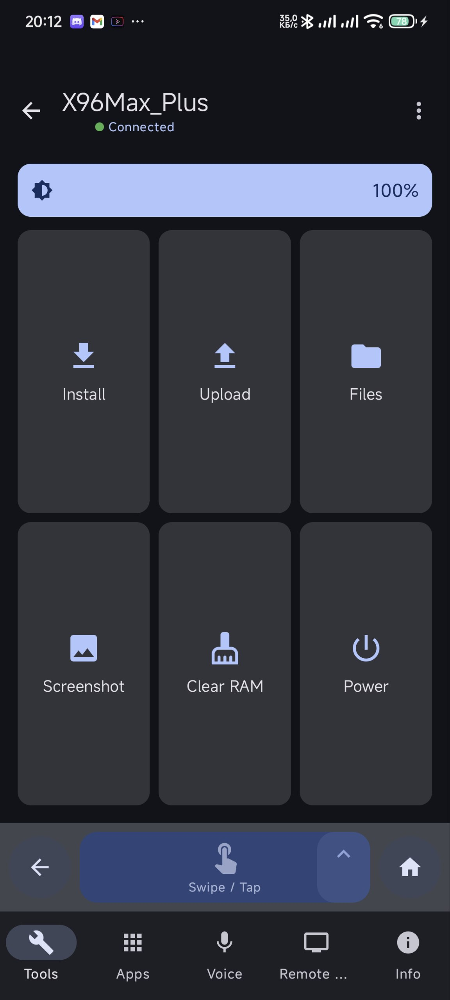
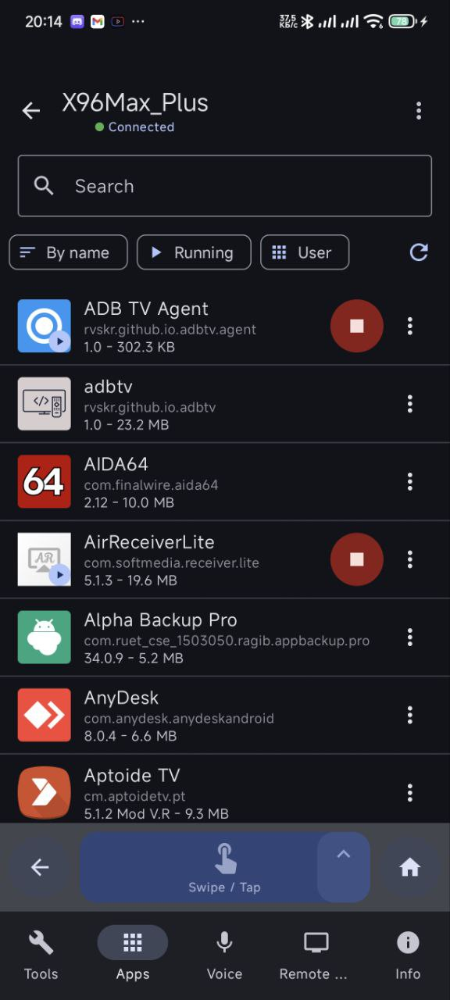
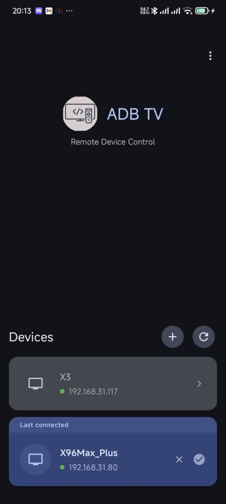

# ADB TV: Powerful Remote Control for Android TV via ADB

ADB TV is a comprehensive solution for remotely managing your Android TV devices, Smart TVs, and set-top boxes via ADB over Wi-Fi.

  
  
  
   
  
  
  

---

## 🎯 KEY FEATURES:

* Remote control of Android TV via WiFi
* Installation and uninstallation of applications
* File manager with upload/download capabilities
* Voice search and commands
* Execution of shell commands
* System device information
* Screen screenshots
* Power management (reboot, shutdown)

## 📱 APPLICATION MANAGEMENT

Easily manage all installed applications: install new ones, uninstall, clear data, and more.

* View installed applications
* Install APK files
* Uninstall applications
* Force stop
* Clear data
* Manage permissions
* Download APK from the device

## 📁 FILE MANAGER

Full access to your TV's file system for easy file transfer and management.

* View file system
* Upload files to TV
* Download files from TV
* Delete and rename
* Install APK files

## 🎤 VOICE CONTROL

Use voice capabilities for search and quick launching of applications.

* Voice search on TV
* Launch applications by voice
* Customizable voice commands
* Support for Russian and English languages

## 🛠️ TOOLS

Powerful tools for system administration, diagnostics, and power management.

* Execute shell commands
* Information about CPU, memory, battery
* Clear RAM
* Create screenshots
* Power management

---

## ⚙️ REQUIREMENTS

* Android TV with USB/Network ADB debugging enabled
* Devices must be on the same WiFi network

## 🔒 PRIVACY

We value your privacy:
* All data is stored locally
* No data transmission to servers
* Open source

---

## 📝 NOTE
To function, ADB debugging must be enabled on your Android TV device.
